# Event Factorial - Система управления мероприятиями

Добро пожаловать в систему управления мероприятиями! Этот проект представляет собой веб-приложение, которое обеспечивает удобное управление мероприятиями в городе Алматы. Пользователи могут легко [просматривать предстоящие события](#главная-страница), [регистрироваться на них](#регистрация-на-события), [управлять своими бронированиями](#страница-управление-билетами) и [управлять учетными записями](#страница-login).

## Базовая инструкция по локальному развертыванию 

This project was generated with [Angular CLI](https://github.com/angular/angular-cli) version 17.3.6.

## Development server

Run `ng serve` for a dev server. Navigate to `http://localhost:4200/`. The application will automatically reload if you change any of the source files.

## Code scaffolding

Run `ng generate component component-name` to generate a new component. You can also use `ng generate directive|pipe|service|class|guard|interface|enum|module`.

## Build

Run `ng build` to build the project. The build artifacts will be stored in the `dist/` directory.

## Running unit tests

Run `ng test` to execute the unit tests via [Karma](https://karma-runner.github.io).

## Running end-to-end tests

Run `ng e2e` to execute the end-to-end tests via a platform of your choice. To use this command, you need to first add a package that implements end-to-end testing capabilities.

## Further help

To get more help on the Angular CLI use `ng help` or go check out the [Angular CLI Overview and Command Reference](https://angular.io/cli) page.

## Django 
```cd backend```


```python manage.py runserver```

# В целом
Веб-приложение создано с помощью фронтенд-фреймковорка Angular и бэкенд-фреймворка Django. 
Данные взяты из [sxodim](https://sxodim.com/almaty). 
Помимо [локального развертывания](#базовая-инструкция-по-локальному-развертыванию), я разместила на хостинге Vercel сайт: https://naza_cool.com

## Этапы разработки
Frontend: Frontend сторона была собрана на компонентах и сервисах(которые связывают frontend и backend api). Компоненты: 
 * [home-page](#главная-страница) - компонент, отвечающий за события. 
 * [booking](#страница-управление-билетами) - компонент, отвечающий за управлениями билетов. Билеты пользователя - это те события, на которые пользователь зарегестрировался.
 * delete-success - активируется когда пользователь нажимает на кнопку **Удалить** на странице **Управление билетами**
 * success-page - активируется когда пользователь нажимает на кнопку **Регистрация / Хочу пойти** на **главной странице**

Навигация между страницами построена на ```RouterModule```. Получение информаций из backend Django благодаря ```Observable``` и ```HttpClient```, кастомным сервисам(```ticket.service.ts```, ```event.service.ts```) с помощью которых делаются ```GET``` запросы. Удаление билета/ регистрация на событие/ логин работают благодаря кастомным сервисам(```ticket.service.ts```, ```event.service.ts```) с помощью которых делаются ```POST``` запросы.

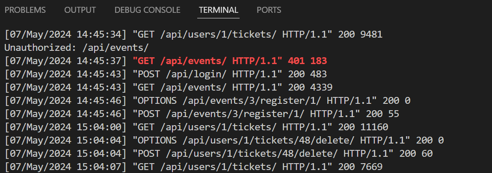

Для [авторизации](#страница-login) использовано Django Rest framework Simple JWT: ```TokenObtainPairView, TokenRefreshView```, Cross-Origin Resource Sharing(CORS) и токены доступа:
Когда пользователь пытается войти в систему, его имя пользователя и пароль отправляются на серверную конечную точку входа. Метод ```login(username: string, password: string):``` отправляет POST-запрос к конечной точке входа на сервере ```/api/login/``` с предоставленным именем пользователя и паролем. Он ожидает получить Observable типа Token(кастомный интерфейс) в качестве ответа.
Если учетные данные верны, сервер отвечает токеном, содержащим токены доступа и обновления.
Сервис Angular сохраняет эти токены в localStorage браузера.
При повторном посещении приложения токен доступа извлекается из localStorage. Если он существует, пользователь считается вошедшим в систему.


### Страница "Login"
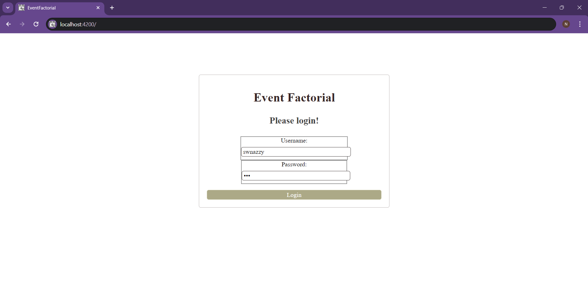
### Главная страница
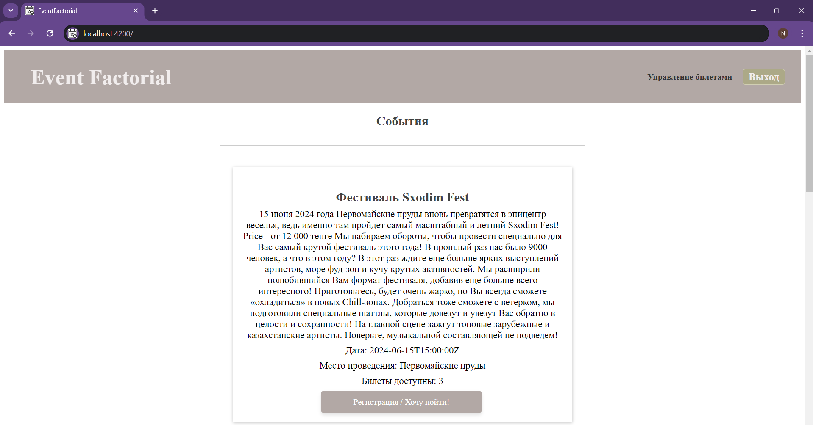
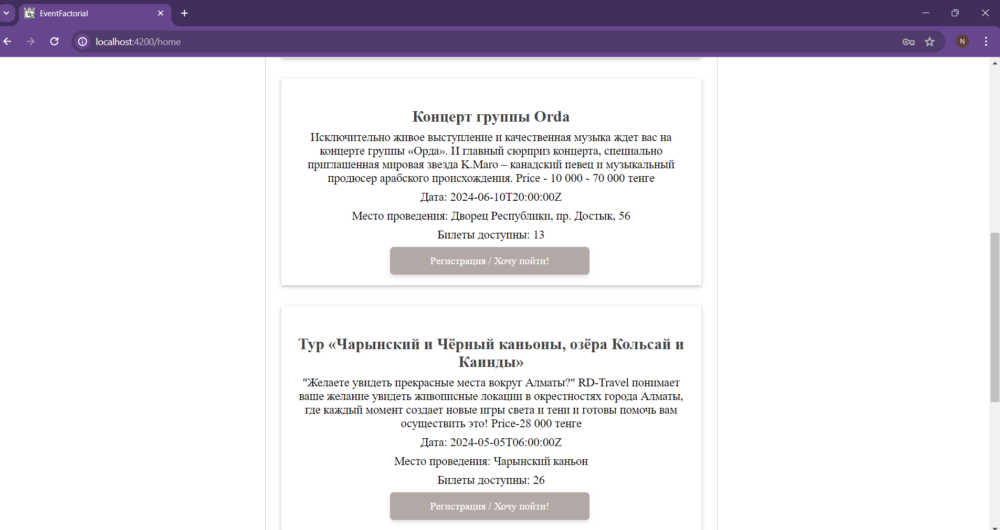
### Регистрация на события
При наведении курсора на кнопку **Регистрация / Хочу пойти** кнопка засвечивается 
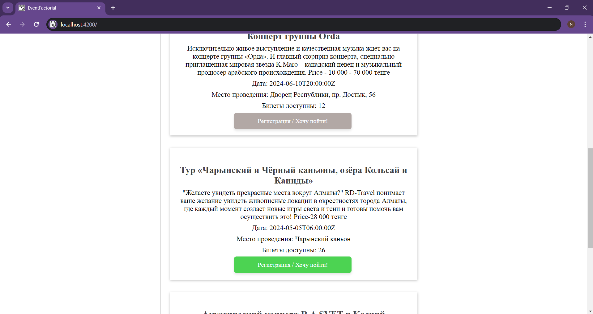
При нажатии на кнопку **Регистрация / Хочу пойти** навигация переходит на компонент **success-page**

### Страница "**Управление билетами**"
 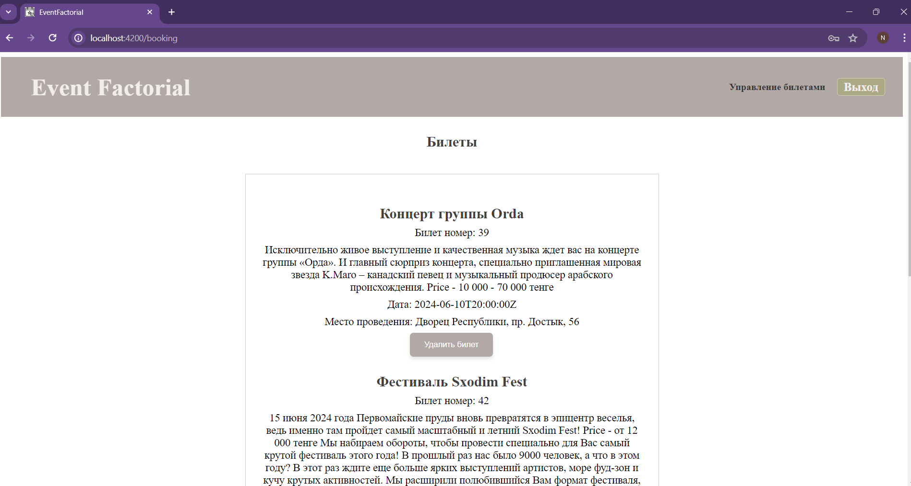 
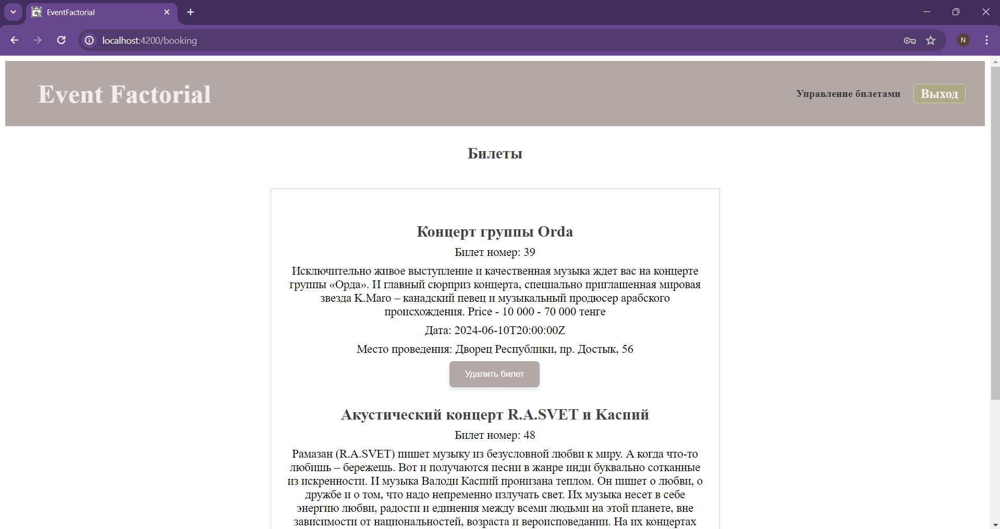
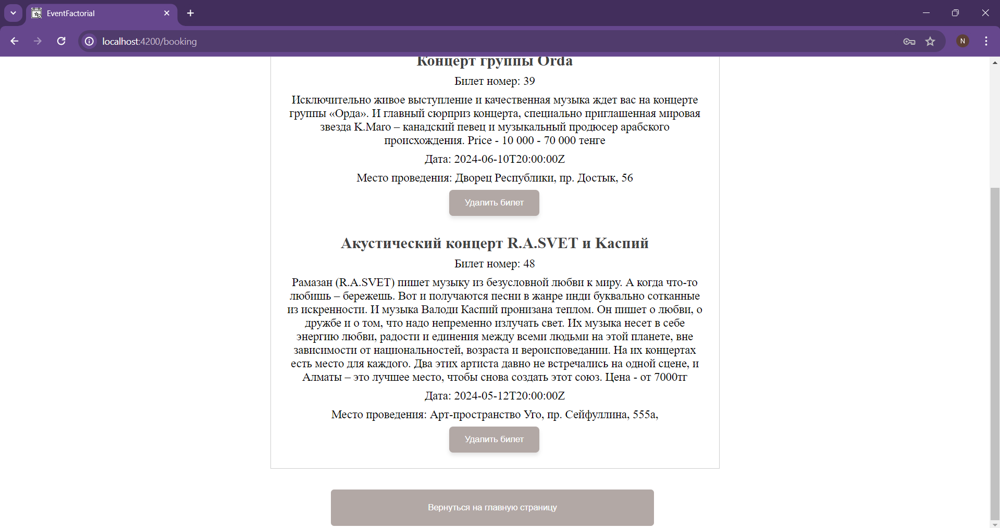
 Пользователь может удалить билет и просмотреть детали билета(на какое событие регистрировался, где пройдет событие, когда оно будет и т.д):
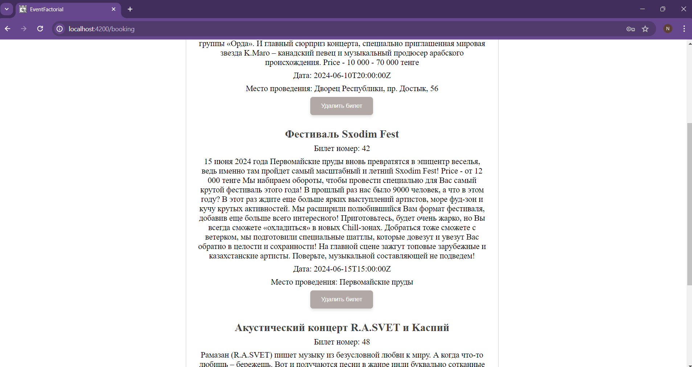
 При нажатии на **удалить билет**, билет успешно удаляется у самого пользователя, номер билета удаляется и тот билет не будет отображаться на странице **Управление билетами**. После удаления билета на [главной странице](#главная-страница) к событию, к которому был привязан билет который удалился, прибавляется место(**Билеты доступны** становятся на один билет больше):
 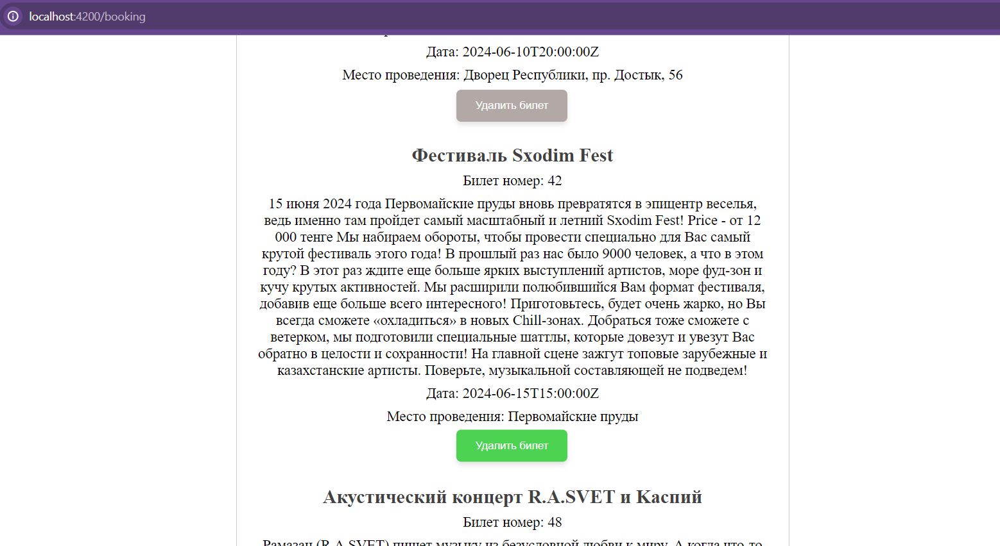
 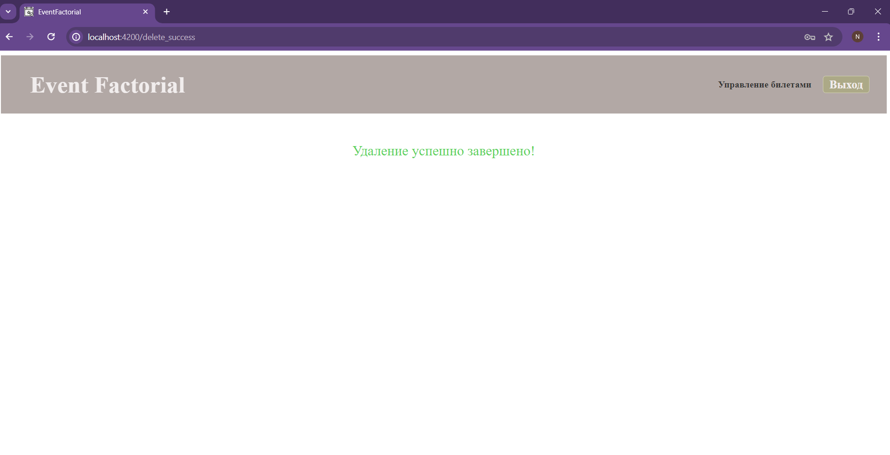

Можно вернуться на главную страницу где отображаются события, нажав на кнопку **Вернуться на главную страницу**
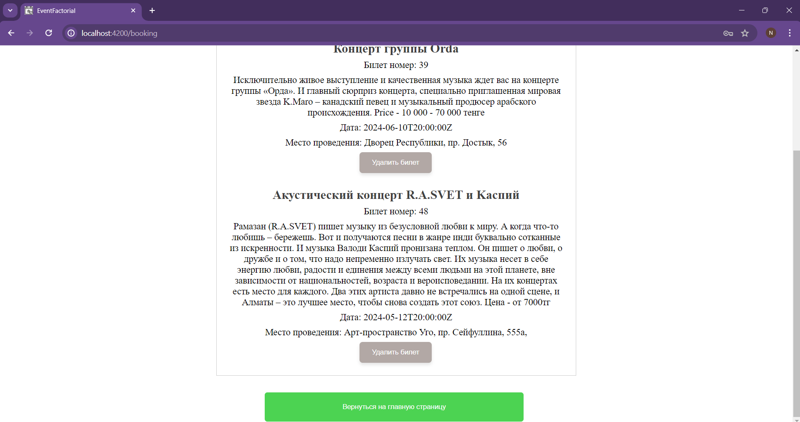